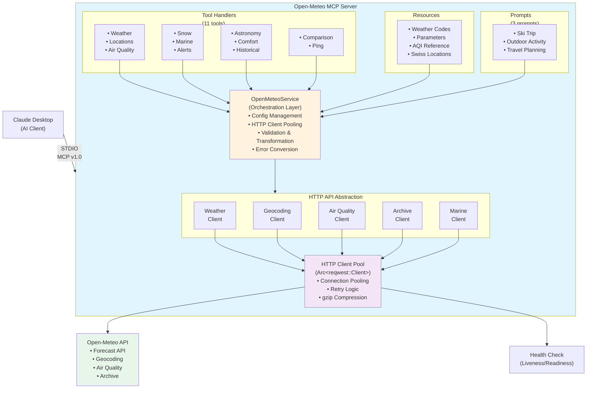
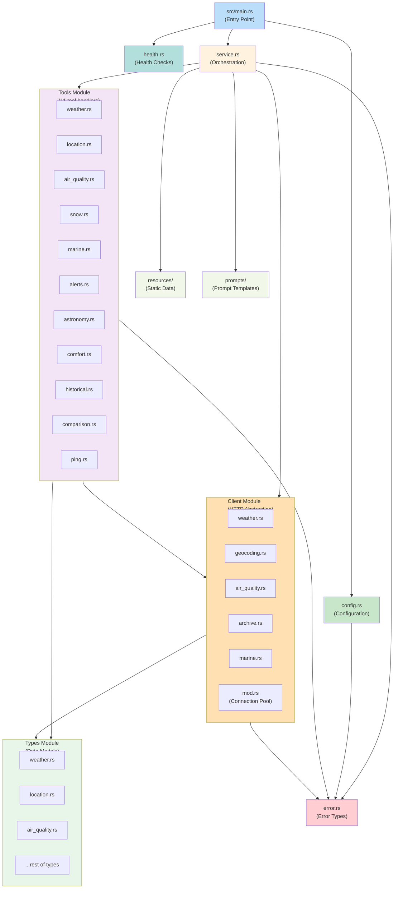
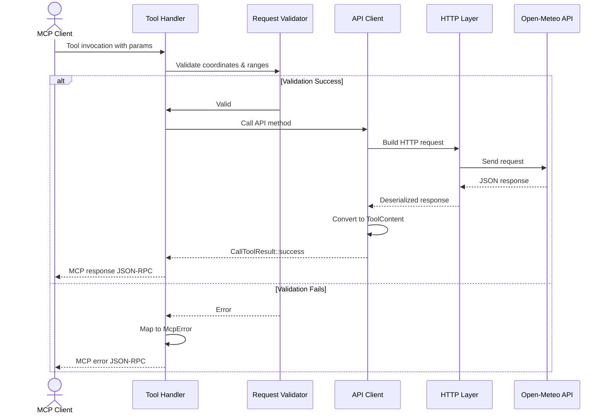
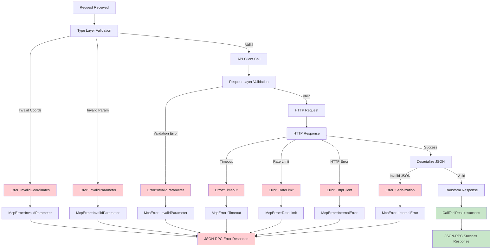
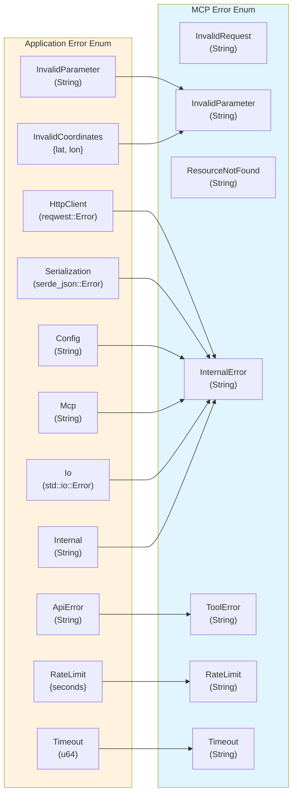
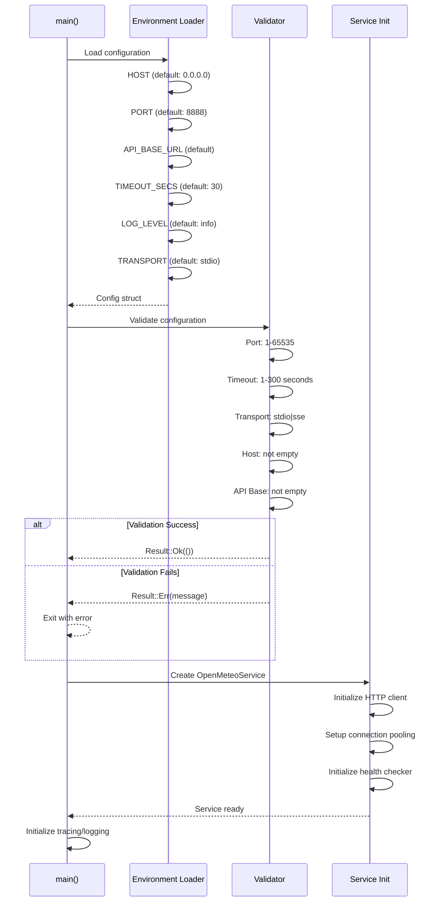
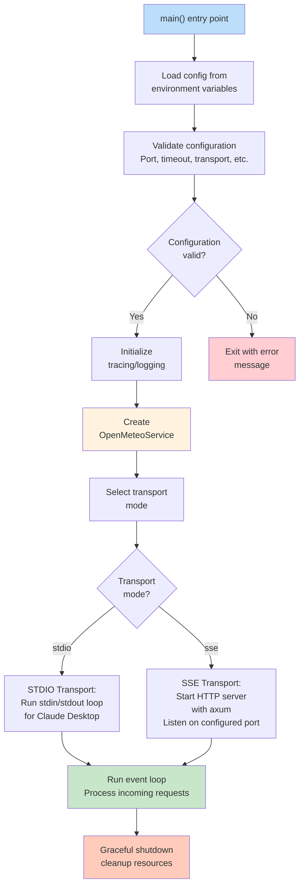
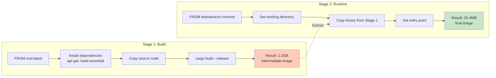

# Open-Meteo MCP Rust - Architecture Documentation

## Overview

**Open-Meteo MCP (Model Context Protocol)** is a production-ready Rust implementation of a weather and environmental data server. It provides Model Context Protocol (MCP) integration for Claude Desktop and other AI applications, exposing 11 weather/environmental tools with comprehensive real-time data access.

**Current Status:** v2.0.0 - Production Ready
**Test Coverage:** 258 tests | ~72% code coverage
**Build:** Docker multi-stage | 26.4MB image

---

## Architecture Principles

1. **Layered Architecture** - Clear separation of concerns
2. **Async-First** - Tokio runtime for all I/O operations
3. **Type Safety** - Rust's type system prevents entire classes of bugs
4. **Validation at Boundaries** - Three-layer validation strategy
5. **Error Transparency** - Detailed error types with MCP protocol mapping
6. **Configurability** - Environment-based configuration with defaults
7. **Testability** - Comprehensive test coverage across all layers

---

## System Architecture



---

## Module Organization

### Module Dependency Graph



### Core Modules

#### `/src/service.rs` - Main Service Layer
**Responsibility:** Service orchestration and lifecycle management

- `OpenMeteoService` struct - Entry point for all MCP operations
- HTTP client connection pooling via `Arc<reqwest::Client>`
- Configuration application and initialization
- Methods:
  - `new(config: Config)` - Initialize service with configuration
  - `http_client()` - Get shared HTTP client
  - `api_client()` - Get API client interface
  - `is_ready()` - Check service readiness

#### `/src/client/mod.rs` - HTTP Client Abstraction
**Responsibility:** HTTP communication and client pooling

- `OpenMeteoClient` struct - Unified HTTP client interface
- Connection pooling with Arc wrapping
- Retry configuration and exponential backoff
- Base URL management for different endpoints
- Methods:
  - `validate_response_status(status)` - HTTP error checking
  - `with_retry()` - Retry configuration builder

#### `/src/client/*.rs` - Specialized API Clients (5 modules)
**Responsibility:** API endpoint-specific request/response handling

1. **`client/weather.rs`** - Weather Forecast API
   - `get_weather()` with coordinate validation
   - Query parameter serialization
   - Response deserialization to `WeatherResponse`

2. **`client/geocoding.rs`** - Location/Geocoding API
   - `search_location()` with name validation
   - Parameter mapping (count, language)
   - Location result parsing

3. **`client/air_quality.rs`** - Air Quality API
   - `get_air_quality()` endpoint
   - Hourly/daily parameter handling
   - AQI response deserialization

4. **`client/marine.rs`** - Marine Conditions API
   - Wave/swell data retrieval
   - Optional parameter handling

5. **`client/archive.rs`** - Historical Data API
   - Date range parameter handling
   - Historical response parsing

#### `/src/tools/*.rs` - MCP Tool Handlers (11 modules)
**Responsibility:** Business logic and MCP protocol compliance

- Implement each MCP tool as a method on `OpenMeteoService`
- Return `Result<CallToolResult, McpError>` for MCP protocol
- Validation → API Call → Response Formatting pattern
- Tools:
  - `tools/weather.rs` - `get_weather()`
  - `tools/location.rs` - `search_location()`
  - `tools/location_swiss.rs` - `search_location_swiss()`
  - `tools/air_quality.rs` - `get_air_quality()`
  - `tools/marine.rs` - `get_marine_conditions()`
  - `tools/snow.rs` - `get_snow_conditions()`
  - `tools/alerts.rs` - `get_weather_alerts()`
  - `tools/astronomy.rs` - `get_astronomy()`
  - `tools/comfort.rs` - `get_comfort_index()`
  - `tools/comparison.rs` - `compare_locations()`
  - `tools/historical.rs` - `get_historical_weather()`

#### `/src/types/*.rs` - Data Models (9 modules)
**Responsibility:** Type-safe request/response DTOs with validation

- Serde for JSON serialization/deserialization
- JsonSchema for MCP schema generation
- Validation methods on request types
- Types:
  - `types/weather.rs` - Weather request/response
  - `types/location.rs` - Geocoding request/response
  - `types/air_quality.rs` - AQI request/response
  - `types/marine.rs` - Marine request/response
  - `types/snow.rs` - Snow request/response
  - `types/alerts.rs` - Alert request/response
  - `types/astronomy.rs` - Astronomy request/response
  - `types/comfort.rs` - Comfort request/response
  - `types/comparison.rs` - Comparison request/response

#### `/src/config.rs` - Configuration Management
**Responsibility:** Environment-based configuration with validation

- `Config` struct - Application configuration
- Environment variable loading via `envy` crate
- Default values for all fields
- Validation method for all parameters
- Fields:
  - `host` - HTTP binding address (default: 0.0.0.0)
  - `port` - HTTP port (default: 8888)
  - `api_base` - Open-Meteo API base URL
  - `timeout_secs` - Request timeout (1-300s, default: 30s)
  - `log_level` - Logging level (default: info)
  - `transport` - Mode selection ("stdio" or "sse")

#### `/src/error.rs` - Error Handling
**Responsibility:** Unified error types and MCP protocol conversion

- `Error` enum - Application errors
- `McpError` enum - MCP protocol errors
- `CallToolResult` - Tool response type
- `ToolContent` - Response content (Text or JSON)
- Error conversions: `From<Error> for McpError`
- `validate_coordinates()` helper function

#### `/src/health.rs` - Health Checking
**Responsibility:** Service health status and readiness probes

- `HealthChecker` struct - Health check service
- `HealthStatus` enum - Liveness/readiness states
- Methods:
  - `check_liveness()` - Basic process health
  - `check_readiness()` - API connectivity with TTL caching
  - `liveness_response()` - Docker/K8s liveness probe
  - `readiness_response()` - Docker/K8s readiness probe

#### `/src/resources/` - Static Resources
**Responsibility:** Embedded JSON data for MCP resources

- Weather code reference (WMO codes)
- Parameter availability documentation
- AQI reference and health recommendations
- Swiss cities and locations database

#### `/src/prompts/` - MCP Prompts
**Responsibility:** AI workflow templates

- Ski trip planning prompt
- Outdoor activity planning prompt
- Weather-aware travel planning prompt

---

## Data Flow Patterns

### Standard Tool Execution Flow



### Error Handling Flow



---

## Validation Strategy

### Three-Layer Validation

**Layer 1: Type-Level Validation** (`src/types/*.rs`)
- `validate()` method on request types
- Checks parameter ranges before API call
- Example: `WeatherRequest.validate()`
  - `forecast_days` in range 1-16
  - Coordinates within ±90° / ±180°

**Layer 2: Request-Level Validation** (Tool handlers)
- Tool method validates before calling API client
- Maps validation errors to `McpError`
- Example: Check location name not empty

**Layer 3: Client-Level Validation** (`src/client/*.rs`)
- Coordinate validation before HTTP request
- Status code validation after HTTP response
- Example: `validate_coordinates()` in weather client

### Validation Examples

```rust
// Weather Request Validation
pub fn validate(&self) -> Result<()> {
    validate_coordinates(self.latitude, self.longitude)?;

    if let Some(days) = self.forecast_days {
        if days < 1 || days > 16 {
            return Err(Error::InvalidParameter(
                "forecast_days must be 1-16".to_string()
            ));
        }
    }
    Ok(())
}
```

---

## Error Type Hierarchy



---

## Configuration & Initialization

### Configuration Loading Order



### Startup Sequence



---

## Testing Architecture

### Test Suite Organization (258 tests)

**Library Unit Tests (78 tests)**
- Type validation tests
- Error handling tests
- Basic functionality tests

**Phase 4: Tool Handler Tests (91 tests)**
- Parameter validation (positive/negative cases)
- Boundary value testing (±90°, ±180° coordinates)
- Tool-specific ranges (forecast_days: 1-16, AQI: 1-5)
- Error handling and edge cases

**Phase 5: Service Layer Tests (89 tests)**
- Error type creation and conversion (37 tests)
- Configuration management (35 tests)
- Service orchestration (17 tests)

### Test Patterns

**Validation Testing Pattern**
```rust
#[tokio::test]
async fn test_invalid_latitude() {
    let service = OpenMeteoService::new(Config::default())?;
    let result = service.get_weather(90.001, 11.6, ...);
    assert!(result.is_err(), "Latitude > 90 should be rejected");
}
```

**Configuration Testing Pattern**
```rust
#[test]
fn test_config_validation_valid_timeout() {
    let mut cfg = Config::default();
    cfg.timeout_secs = 60;
    assert!(cfg.validate().is_ok());
}
```

**Error Conversion Testing Pattern**
```rust
#[test]
fn test_error_to_mcp_conversion() {
    let err = Error::InvalidCoordinates { lat: 91.0, lon: 0.0 };
    let mcp_err: McpError = err.into();
    assert!(mcp_err.to_string().contains("Invalid parameter"));
}
```

---

## Key Design Decisions

### 1. Async-First Architecture
- **Decision:** Use Tokio runtime for all I/O
- **Rationale:** Non-blocking concurrent requests, better resource utilization
- **Trade-off:** Requires async/await syntax throughout

### 2. Three-Layer Validation
- **Decision:** Validate at type, request, and client levels
- **Rationale:** Catch errors early, prevent invalid API calls, ensure safety
- **Trade-off:** Slight performance overhead from multiple validation passes

### 3. Error Type Conversion
- **Decision:** Implement `From<Error> for McpError`
- **Rationale:** Clean separation between app errors and MCP protocol
- **Trade-off:** Manual mapping required, but explicit and clear

### 4. HTTP Client Pooling
- **Decision:** Use `Arc<reqwest::Client>` across service instances
- **Rationale:** Reuse TCP connections, reduce overhead
- **Trade-off:** Requires Arc wrapping, shared mutable state

### 5. Exponential Backoff Retry
- **Decision:** Implement retry logic in client layer
- **Rationale:** Handle transient failures gracefully
- **Trade-off:** Increased latency on failure, complexity in error handling

### 6. Configuration via Environment
- **Decision:** Use environment variables with sensible defaults
- **Rationale:** Follows 12-factor app principles, container-friendly
- **Trade-off:** Less flexible than config files in some scenarios

---

## Deployment Architecture

### Docker Multi-Stage Build



### Health Checks

**Liveness Probe** - Basic process health
- Endpoint: `/health/live`
- Response: HTTP 200 with status JSON
- Use case: Kubernetes/Docker container alive check

**Readiness Probe** - API connectivity
- Endpoint: `/health/ready`
- Response: HTTP 200 if API reachable
- TTL Caching: 5 seconds (avoid excessive checks)
- Use case: Traffic routing to ready instances

---

## Performance Characteristics

### Resource Usage
- **Memory:** ~50-100MB (includes HTTP client pooling)
- **CPU:** Event-driven, low under idle
- **Binary Size:** 26.4MB (Docker image)
- **Startup Time:** <1 second

### Concurrency
- **Connection Pool:** Default 32 connections
- **Timeout:** Configurable, default 30 seconds
- **Retry:** Exponential backoff, max 3 attempts
- **Concurrent Requests:** Limited by pool size

### Latency
- **Forecast Requests:** 200-500ms (API dependent)
- **Geocoding:** 50-200ms (location dependent)
- **Health Check:** <100ms
- **MCP Message Handling:** <50ms

---

## Security Considerations

### Input Validation
- All geographic coordinates validated (-90..90, -180..180)
- Parameter ranges enforced (forecast_days: 1-16)
- Empty string validation for names
- Type system prevents many injection attacks

### Network Security
- HTTPS only for API calls (built into Open-Meteo API)
- Connection pooling reduces man-in-the-middle window
- Timeout protection against slow-rate attacks

### Error Handling
- No sensitive data in error messages
- Clear distinction between user errors and system errors
- Proper error propagation without information leakage

---

## Future Extensibility

### Adding New Tools
1. Create request/response types in `src/types/`
2. Implement validation in type's `validate()` method
3. Create API client method in appropriate `src/client/*.rs`
4. Implement tool handler in new `src/tools/*.rs` file
5. Add test file in `tests/tools_*.rs`

### Adding New API Endpoints
1. Create specialized client in `src/client/new_api.rs`
2. Implement HTTP communication with pooled client
3. Add deserialization types in `src/types/`
4. Create wrapper method in `OpenMeteoService`

### Performance Optimization
1. Implement response caching layer
2. Add batch request support
3. Optimize JSON serialization with `simd-json`
4. Profile with `perf` and `flamegraph`

---

## Debugging & Troubleshooting

### Enable Debug Logging
```bash
RUST_LOG=open_meteo_mcp=debug ./target/release/open-meteo-mcp
```

### Check Service Health
```bash
curl http://localhost:8888/health/live
curl http://localhost:8888/health/ready
```

### Verify Configuration
```bash
# Check loaded configuration
RUST_LOG=debug ./target/release/open-meteo-mcp
# Look for "Config loaded:" log line
```

### Common Issues

**"Invalid coordinates" error**
- Ensure latitude is -90 to 90
- Ensure longitude is -180 to 180

**"Timeout" error**
- Increase `TIMEOUT_SECS` (default 30)
- Check network connectivity to Open-Meteo API

**"Rate limit" error**
- Service implements automatic retry with backoff
- Consider implementing client-side request queuing

---

## References

- [Model Context Protocol (MCP) Specification](https://modelcontextprotocol.io/)
- [Open-Meteo API Documentation](https://open-meteo.com/en/docs)
- [Tokio Async Runtime](https://tokio.rs/)
- [Rust async/await](https://rust-lang.github.io/async-book/)
- [Serde Serialization Framework](https://serde.rs/)

---

**Last Updated:** February 2026
**Version:** 2.0.0
**Status:** Production Ready
